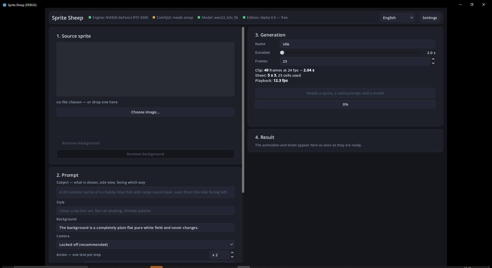

# Sprite Sheep

From one sprite and a prompt, generates an **animated sprite sheet** and a GIF,
locally, using video diffusion models.

> **Pre-alpha 0.0.4.** It works, but it has rough edges. Interfaces and formats
> may change without notice.

**[Download the build on itch.io](https://shaddafare.itch.io/sprite-sheep)** —
Windows 64-bit, about 105 MB, no build step required. This repository is the
source; if you just want to try the program, that link is the place to go.



## What it does

You load a character drawing, write what it should do, and get a 5×5 grid of 25
frames with a transparent background, plus an animated preview. The video model
generates the movement; the program cuts the frames out, keys the background
and composes the sheet.

## How it is built

Two pieces talking to each other over `localhost`:

| | |
|---|---|
| `godot/` | the interface, in Godot 4.6 |
| `sidecar/` | the Python service that drives inference |

Godot **cannot** run inference: that needs PyTorch and CUDA. So it starts the
sidecar as a child process and talks to it over HTTP. The heavy lifting is done
by ComfyUI, which has its own environment.

## What you need to run it

1. **ComfyUI**, installed and working
2. **A model**, downloadable from within the program
3. An NVIDIA GPU with at least 8 GB of VRAM

The program checks by itself what is missing and says so in the Settings
window.

### Models

| Model | Size | Licence |
|---|---|---|
| MiniMax H3 | 38.9 GB | Community License — **excludes the EU, the UK, South Korea and the United States**, and the clause covers the outputs as well |
| WAN 2.2 | 16.9 GB | Apache 2.0, no territorial restrictions |

**MiniMax H3 is the one that works.** WAN 2.2 is **in progress**: the VAE decode
thrashes under 8 GB of VRAM and does not finish. It is selectable, but not
reliable yet.

The program shows the licence in full and blocks the download until you accept
it. **Read it**: MiniMax H3's carries territorial restrictions that cover what
you produce with it, not only the model itself.

## Building

Only needed if you want to change the program. To simply use it, take the
[itch.io build](https://shaddafare.itch.io/sprite-sheep).

```
python build_runtime.py     # embedded Python runtime
python build_licenze.py     # third-party licences
python build.py             # exports the executable and makes the zip
```

Requires Godot 4.6.1 in `C:\GODOT\`. The path is at the top of `build.py`.

## A note on the source

Code comments are written in **Italian**, deliberately: they explain why
something is the way it is, not what the line does, and they were written in
the author's language to say it precisely. Identifiers, user-facing strings and
documentation are in English.

## Licence

[MIT](LICENSE) — do what you like with it, keep the copyright notice.

This covers Sprite Sheep's own code. Two things it does **not** cover:

**ComfyUI** is third-party free software under GPL-3.0. Sprite Sheep neither
redistributes nor embeds it: you install it yourself, and the two programs talk
over HTTP on localhost.

**The model weights** are not included and remain subject to their authors'
licences, which the program shows you before downloading. See the warning about
MiniMax H3 above.

`THIRD-PARTY-LICENCES.txt`, generated by `build_licenze.py`, lists every bundled
dependency with its licence and ships inside the distributed package.

## History

Up to 0.9 there were two editions, one with a watermark on every frame and one
without. From 0.0.1 pre-alpha there is **a single edition, without a
watermark**. The numbering restarts from zero because the project does: what
came before was a prototype with a commercial model bolted on, this is the
program.
